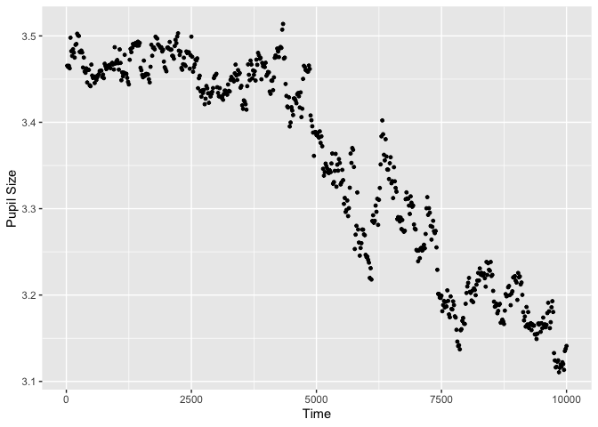

<!-- README.md is generated from README.Rmd. Please edit that file -->

# PupillometryR

<!-- badges: start -->

[](https://CRAN.R-project.org/package=PupillometryR)
[](https://app.travis-ci.com/samhforbes/PupillometryR)
[](https://doi.org/10.21105/joss.02285)

<!-- badges: end -->

The goal of PupillometryR is to to pre-process and then analyze simple
pupil experiments in R.

## Installation

You can install the released version of PupillometryR from
[CRAN](https://CRAN.R-project.org) with:

``` r
install.packages("PupillometryR")
```

And the development version from [GitHub](https://github.com/) with:

``` r
# install.packages("devtools")
devtools::install_github("samhforbes/PupillometryR")
```

## Setup

This package (and the example dataset) was designed in part, based on
Sylvain Sirois’ MATLAB tutorial, [which can be found
here](https://oraprdnt.uqtr.uquebec.ca/pls/public/gscw031?owa_no_site=314&owa_no_fiche=3&owa_bottin=https://oraprdnt.uqtr.uquebec.ca/pls/public/gscw031?owa_no_site=314&owa_no_fiche=3&owa_bottin=).

The intention is an integrated pipeline for pupillometric experiments,
from data cleaning, pre-processing, various analysis techniques, and
visualising results.

To use all the functionality and plots that follow from the
PupillometryR pipeline, please start with *make\_pupillometryr\_data*,
e.g.:

``` r
library(PupillometryR)
#> Loading required package: dplyr
#> 
#> Attaching package: 'dplyr'
#> The following objects are masked from 'package:stats':
#> 
#>     filter, lag
#> The following objects are masked from 'package:base':
#> 
#>     intersect, setdiff, setequal, union
#> Loading required package: ggplot2
#> Loading required package: rlang

data("pupil_data")

#Check that IDs are not numeric
pupil_data$ID <- as.character(pupil_data$ID)
#remove participant number 8, who had problematic data
pupil_data <- subset(pupil_data, ID != 8)
#blinks were registered as -1, so replace with NAs
pupil_data$LPupil[pupil_data$LPupil == -1] <- NA
pupil_data$RPupil[pupil_data$RPupil == -1] <- NA

Sdata <- make_pupillometryr_data(data = pupil_data,
                                 subject = ID,
                                 trial = Trial,
                                 time = Time,
                                 condition = Type)
```

All further functions associated with the package follow from there. For
example:

``` r
plot(Sdata, pupil = LPupil, group = 'condition')
#> Warning: Removed 3639 rows containing non-finite values (stat_summary).
```



To follow a detailed walkthrough, run:

``` r
vignette('PupillometryR')
```

or head to
[samforbes.me/PupillometryR](http://samforbes.me/PupillometryR/)

## Getting help

Please use the issues tab
(<https://github.com/samhforbes/PupillometryR/issues>) to file any bugs
or suggestions. For general pupillometry information, I recommend
[Sylvain’s
website](https://oraprdnt.uqtr.uquebec.ca/pls/public/gscw031?owa_no_site=314&owa_no_fiche=3&owa_bottin=https://oraprdnt.uqtr.uquebec.ca/pls/public/gscw031?owa_no_site=314&owa_no_fiche=3&owa_bottin=),
[as well as Jackson and Sirois
(2009)](https://doi.org/10.1111/j.1467-7687.2008.00805.x). For reading
about using GAMs in pupillometry [this paper by van Rij et al. is
excellent](https://journals.sagepub.com/doi/10.1177/2331216519832483),
for general GAMs knowledge I recommend [this tutorial by Michael
Clark](https://m-clark.github.io/generalized-additive-models/case_for_gam.html)
as well as the mgcv documentation, and for general FDA information [this
website is
helpful](https://www.psych.mcgill.ca/misc/fda/resources.html), along
with the Ramsay and Silverman book (1997). Additionally, check out the
[raincloud plots paper by Allen et
al.](https://wellcomeopenresearch.org/articles/4-63#:~:text=In%20essence%2C%20raincloud%20plots%20combine,error%2C%20such%20as%20a%20boxplot.),
which is used for some of the in-built plotting in this package.

## Citation

Please cite the JOSS paper for this package if you use it: Forbes, S.
(2020). PupillometryR: An R package for preparing and analysing
pupillometry data. Journal of Open Source Software, 5(50), 2285.
<https://doi.org/10.21105/joss.02285>

## Acknowledgements

This package has had suggestions, encouragement, and help from a number
of people, but I wish to especially highlight Sylvain Sirois and Mihaela
Duta, whose input has been instrumental. I’d also like to thank Jacolien
van Rij for her input with the GAMs modelling portion of this tutorial,
and TJ Mahr for contributing to extending the use of GAMs in the
vignette.

## References

\[1\] Jackson, I., & Sirois, S. (2009). Infant cognition: Going full
factorial with pupil dilation. *Developmental Science*, 12(4), 670-679.
<https://doi.org/10.1111/j.1467-7687.2008.00805.x>

\[2\] Allen, M., Poggiali, D., Whitaker, K., Marshall, T. R., & Kievit,
R. (2019). Raincloud plots: a multi-platform tool for robust data
visualization. *Wellcome Open Research*, 4, 1-41.
<https://doi.org/10.12688/wellcomeopenres.15191.1>

\[3\] Ramsay, J.O., & Silverman, B.W. (1997). *Functional data
analysis*. New York: Springer-Verlag.

\[4\] van Rij, J., Hendriks, P., van Rijn, H., Baayen, R. H., & Wood, S.
N. (2019). Analyzing the time course of pupillometric data. *Trends in
Hearing*, 23, 233121651983248.
<https://doi.org/10.1177/2331216519832483>
