### Update July 2019 PupillometryR 0.0.1

-   New functions: - calculate\_missing\_data() to analyse amount of
    trackloss - clean\_missing\_data() to clean by threshold -
    downsample\_time\_data() to reduce autocorrelation by placing data
    into timebins and downsampling
-   Messaging functionality improved
-   updated readme

Introduction
------------

PupillometryR is a package to pre-process and then analyze simple pupil
experiments in R. The best way to download it is to open up R in
RStudio, and download it after [downloading
devtools](https://www.r-project.org/nosvn/pandoc/devtools.html). It
first needs to be downloaded before running, if you have devtools, it
can be done directly from the console in R:

``` r
devtools::install_github('samhforbes/PupillometryR')
```

Once we have the package downloaded, we need to load in the package to
get started:

``` r
library(PupillometryR)
```

    ## Loading required package: dplyr

    ## 
    ## Attaching package: 'dplyr'

    ## The following objects are masked from 'package:stats':
    ## 
    ##     filter, lag

    ## The following objects are masked from 'package:base':
    ## 
    ##     intersect, setdiff, setequal, union

    ## Loading required package: ggplot2

    ## Loading required package: rlang

This package is designed to make dealing with pupil data (perhaps more
traditionally done in MATLAB) easier to wrangle in R. It makes heavy use
of a few packages which should be acknowledged here, especially the
(excellent) packages fda and signal.

As well as the above packages, it is very important to note that the
type of analysis shown here has been available in MATLAB for a while,
and there is an excellent tutorial on it, which I thoroughly recommend
reading first, written by Sylvain Sirois,
[here:](https://oraprdnt.uqtr.uquebec.ca/pls/public/gscw031?owa_no_site=314&owa_no_fiche=3&owa_bottin=https://oraprdnt.uqtr.uquebec.ca/pls/public/gscw031?owa_no_site=314&owa_no_fiche=3&owa_bottin=).

It’s worth making sure that your setup and experiment do facilitate the
use of pupillometry - it may not be suited for all kinds of experiment.

Getting started
---------------

We will first run through an example analysis with the data provided in
the package, which, again, comes from Sylvain Sirois’ tutorial on [his
webpage](https://oraprdnt.uqtr.uquebec.ca/pls/public/gscw031?owa_no_site=314&owa_no_fiche=3&owa_bottin=https://oraprdnt.uqtr.uquebec.ca/pls/public/gscw031?owa_no_site=314&owa_no_fiche=3&owa_bottin=).

The first thing I would recommend doing is having a close look at the
pupil data. Eyetrackers have a couple of different ways of dealing with
this, so it’s important to know a few things:

1.  What unit of measurement is being used
2.  What value is given to missing data or blinks (typically ., -1, or
    *NA*)
3.  What framerate were you recording at, and is this consistent.

The data here is an eyetracking experiment with hard and easy trials,
performed on 9 participants. Participant 8 needs to be removed (more
details on Sylvain’s tutorial).

``` r
data("pupil_data")

#Check that IDs are not numeric
pupil_data$ID <- as.character(pupil_data$ID)
#remove participant number 8, who had problematic data
pupil_data <- subset(pupil_data, ID != 8)
#blinks were registered as -1, so replace with NAs
pupil_data$LPupil[pupil_data$LPupil == -1] <- NA
pupil_data$RPupil[pupil_data$RPupil == -1] <- NA
```

The plotting is also a theme of this tutorial, so I will set a nice
theme that makes the plots look pretty:

``` r
library(ggplot2)
theme_set(theme_classic(base_size = 12))
```

First up, we need to put the data into pupillometryR format for further
analysis

``` r
Sdata <- make_pupillometryr_data(data = pupil_data,
                                 subject = ID,
                                 trial = Trial,
                                 time = Time,
                                 condition = Type)
```

In the current data, it is not a concern, but there may be a situation
where certain timebins are missing from your data. This can be fixed
here, and we will look at the raw data:

``` r
new_data <- replace_missing_data(data = Sdata)
```

    ## replace_missing_data will only help if you have missing timepoints, and a reliable time column.

``` r
head(new_data)
```

    ##   ID Trial      Time   RPupil   LPupil Timebin Type
    ## 1  1 Easy1  16.66667 3.233615 2.935160       1 Easy
    ## 2  1 Easy1  33.33333 3.216972 2.919698       2 Easy
    ## 3  1 Easy1  50.00000 3.205405 2.924402       3 Easy
    ## 4  1 Easy1  66.66667 3.217505 2.935777       4 Easy
    ## 5  1 Easy1  83.33333 3.214905 2.928921       5 Easy
    ## 6  1 Easy1 100.00000 3.211777 2.922048       6 Easy

Equally, if your data is not cut to the time windows that you are
interested in, the subset\_data function allows trimming. PupillometryR
has some built-in plotting functions to allow you to look at certain
data types. You simply need to specify a pupil column to display, and
how you would like the data displayed in groups. The plots are ggplot
items, so can be edited with themes, and arguments such as ylab(). Below
we display it first by condition, then by subject:

``` r
plot(new_data, pupil = LPupil, group = 'condition')
```

    ## Warning: Removed 3639 rows containing non-finite values (stat_summary).


``` r
plot(new_data, pupil = LPupil, group = 'subject') 
```

    ## Warning: Removed 3639 rows containing non-finite values (stat_summary).


Smoothing and cleanup
---------------------

PupillometryR offers a few smoothing options to make processing the data
a little easier. We’ll do the full set here. A great reference for these
is Sylvain’s tutorial, and also Jackson and Sirois, 2009, Dev. Sci.
First off, we can regress one pupil against the other to get some
measure of smoothing.

``` r
regressed_data <- regress_data(data = new_data,
                               pupil1 = RPupil,
                               pupil2 = LPupil)
```

Now that we have done that, we want the mean of the two pupil sizes, so
let’s see how that looks:

``` r
mean_data <- calculate_mean_pupil_size(data = regressed_data, 
                                       pupil1 = RPupil, 
                                       pupil2 = LPupil)

plot(mean_data, pupil = mean_pupil, group = 'subject')
```

    ## Warning: Removed 3591 rows containing non-finite values (stat_summary).

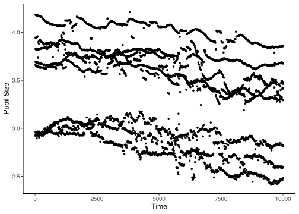

Now that we have a single pupil measure to work with, we can manipulate
the data a little more easily. First thing we can do is to downsample
the data. This is useful when we have large scale data, or when we have
sampled at a really high rate, and we need to reduce it so we are
measuring meaningful change. Here we have taken the median, but he mean
could also be taken. We just need to specify the timebin size, in ms:

``` r
mean_data <- downsample_time_data(data = mean_data,
                              pupil = mean_pupil,
                              timebin_size = 50,
                              option = 'median')
```

    ## Calculating median pupil size in each timebin

Now we need to clean up our data - let’s first assess how much missing
data there is:

``` r
missing <- calculate_missing_data(mean_data, 
                                  mean_pupil)
head(missing)
```

    ## # A tibble: 6 x 3
    ##   ID    Trial Missing
    ##   <chr> <fct>   <dbl>
    ## 1 1     Easy1  0.104 
    ## 2 1     Hard1  0.144 
    ## 3 1     Easy2  0.0846
    ## 4 1     Hard2  0.104 
    ## 5 1     Easy3  0.149 
    ## 6 1     Hard3  0.139

We can see if we view the whole file that participant 6 has a fair
amount of trials with a high missing data proportion. Now we need to
clean this up. We have two parameters to do this - first is the
proportion of *data* that we can accept missing in one trial before
removing it from analysis. The second is what proportion of *trials* we
can accept as missing before removing a participant for being
unreliable. In this example, we will remove trials that have more than
75% of data missing, and we will remove participants that have more than
75% of trials removed.

``` r
mean_data2 <- clean_missing_data(mean_data,
                                 pupil = mean_pupil,
                                 trial_threshold = .75,
                                 subject_trial_threshold = .75)
```

    ## Removing trials with a proportion missing > 0.75 
    ##  ...removed 0 trials

    ## Removing subjects with a proportion of missing trials > 0.75 
    ##  ...removed 0 subjects

Now we come to filtering the data. PupillometryR offers 3 filter types:
A hanning window, a low-pass butterworth filter, and a median filter.
The low-pass filter can be a little unstable at the beginning and end of
each trial, so it’s worth looking at your data to see if it’s
appropriate. Here we will use the median filter. The degree gives the
size of the rolling window.

``` r
filtered_data <- filter_data(data = mean_data2,
                             pupil = mean_pupil,
                             filter = 'median',
                             degree = 11)
```

    ## Performing median filter

``` r
plot(filtered_data, pupil = mean_pupil, group = 'subject')
```

    ## Warning: Removed 1376 rows containing non-finite values (stat_summary).

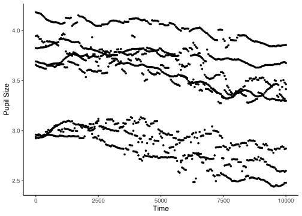

The next step is to interpolate across blinks. Filtering before the
interpolation generally allows more sensible interpolation, but the way
this is done varies a bit on the data, and you will see examples without
this. We can interpolate in this package either linear or cubic, but
again, it’s best to always check your data afterwards to make sure it
looks the way you might expect. Here we opt for the linear
interpolation:

``` r
int_data <- interpolate_data(data = filtered_data,
                             pupil = mean_pupil,
                             type = 'linear')
```

    ## Performing linear interpolation

``` r
plot(int_data, pupil = mean_pupil, group = 'subject')
```


Baselining the data is a powerful way of making sure we control for
between-participant variance of average pupil size. If we are looking at
analyses that are largely within-subject, as we do here, this may not be
such an issue, but we will do this anyway. This function allows us to
baseline to the mean pupil size within a time window. Here we are just
taking the first 100ms of the trial. If your baseline period is just
outside of your analysis window (which it often will be), you can use
subset\_data() to remove that after baselining.

``` r
base_data <- baseline_data(data = int_data,
                           pupil = mean_pupil,
                           start = 0,
                           stop = 100)

plot(base_data, pupil = mean_pupil, group = 'subject')
```

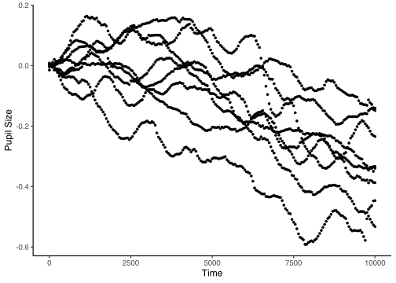

Window analyses
---------------

PupillometryR gives us a couple of options for window analysis. One is
overall averages, the other is to break the data up into discrete time
windows, and to analyse them. First we will opt for the overall
averages. We can plot these with any of boxplots, violin plots, or,
since the new edition, Micah Allen-esque raincloud plots (Allen et al.,
2018).

``` r
window <- create_window_data(data = base_data,
                             pupil = mean_pupil)

plot(window, pupil = mean_pupil, windows = F, geom = 'boxplot')
```

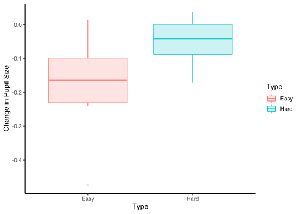

``` r
head(window)
```

    ##   ID Type   mean_pupil
    ## 1  1 Easy -0.227838342
    ## 2  1 Hard -0.069627994
    ## 3  2 Easy -0.100820080
    ## 4  2 Hard  0.001625416
    ## 5  3 Easy -0.092679658
    ## 6  3 Hard  0.000489152

We could then simply analyse this with a t-test if we wished.

``` r
t.test(mean_pupil ~ Type, paired = T, data = window)
```

    ## 
    ##  Paired t-test
    ## 
    ## data:  mean_pupil by Type
    ## t = -3.8043, df = 7, p-value = 0.006677
    ## alternative hypothesis: true difference in means is not equal to 0
    ## 95 percent confidence interval:
    ##  -0.20721815 -0.04835966
    ## sample estimates:
    ## mean of the differences 
    ##              -0.1277889

Alternatively, we may wish to look at the data in chunks. Here we group
the data in to 2000ms timebins for analysis (and we will opt for the
raincloud plot in this instance):

``` r
timeslots <- create_time_windows(data = base_data,
                                 pupil = mean_pupil,
                                 breaks = c(0, 2000, 4000, 6000, 8000, 10000))

plot(timeslots, pupil = mean_pupil, windows = T, geom = 'raincloud')
```

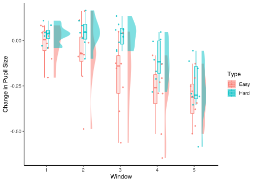

``` r
head(timeslots)
```

    ##   ID Type Window  mean_pupil
    ## 1  1 Easy      1 -0.01558936
    ## 2  1 Easy      2 -0.19736969
    ## 3  1 Easy      3 -0.38981814
    ## 4  1 Easy      4 -0.29046219
    ## 5  1 Easy      5 -0.25125856
    ## 6  1 Hard      1  0.03128440

And again, we could analyse this with an anova:

``` r
car::Anova(lm(mean_pupil ~ Window * Type, data = timeslots))
```

    ## Anova Table (Type II tests)
    ## 
    ## Response: mean_pupil
    ##              Sum Sq Df F value    Pr(>F)    
    ## Window      1.06207  4 13.1506 4.848e-08 ***
    ## Type        0.32858  1 16.2740 0.0001379 ***
    ## Window:Type 0.10028  4  1.2417 0.3013144    
    ## Residuals   1.41334 70                      
    ## ---
    ## Signif. codes:  0 '***' 0.001 '**' 0.01 '*' 0.05 '.' 0.1 ' ' 1

Modelling with Generalised Additive Models
------------------------------------------

Here we interfact with the mgcv package, an exceptionally powerful
package for GAM data, by Simon Wood. I strongly encourage reading the
vignette and checking out some of the great online tutorials (of which
there are plenty; I quite like Michael Clark’s one
[here](https://m-clark.github.io/generalized-additive-models/case_for_gam.html))
before proceeding with these.

We have to do a little bit of setting up of our variables (scaling and
centering) before we continue. I need to make some variables numeric
(the ones with an n on the end), and I am using the way trials are
labelled to make this a numeric variable (this would probably be
different for your data).

``` r
library(mgcv)
```

    ## Loading required package: nlme

    ## 
    ## Attaching package: 'nlme'

    ## The following object is masked from 'package:dplyr':
    ## 
    ##     collapse

    ## This is mgcv 1.8-28. For overview type 'help("mgcv-package")'.

``` r
base_data$IDn <- as.numeric(base_data$ID)
base_data$Typen <- ifelse(base_data$Type == 'Easy', .5, -.5)
base_data$Trialn <- as.numeric(substr(base_data$Trial, 5, 5))
base_data$Trialn <- ifelse(base_data$Typen == .5, base_data$Trialn, base_data$Trialn + 3)
base_data$ID <- as.factor(base_data$ID)
base_data$Trial <- as.factor(base_data$Trial)
```

Right, let’s proceed with setting up a simple model. It’s recommended
for the amount of data points we might have for PupillometryR, bams
might be a better option, but both gam() and bam() will work.

``` r
m1 <- bam(mean_pupil ~ s(Time) +
            s(Time,  by = Typen),
          data = base_data,
          family = gaussian)

summary(m1)
```

    ## 
    ## Family: gaussian 
    ## Link function: identity 
    ## 
    ## Formula:
    ## mean_pupil ~ s(Time) + s(Time, by = Typen)
    ## 
    ## Parametric coefficients:
    ##              Estimate Std. Error t value Pr(>|t|)    
    ## (Intercept) -0.117178   0.001984  -59.05   <2e-16 ***
    ## ---
    ## Signif. codes:  0 '***' 0.001 '**' 0.01 '*' 0.05 '.' 0.1 ' ' 1
    ## 
    ## Approximate significance of smooth terms:
    ##                 edf Ref.df     F p-value    
    ## s(Time)       7.197  8.226 434.7  <2e-16 ***
    ## s(Time):Typen 7.331  8.483 167.2  <2e-16 ***
    ## ---
    ## Signif. codes:  0 '***' 0.001 '**' 0.01 '*' 0.05 '.' 0.1 ' ' 1
    ## 
    ## R-sq.(adj) =  0.341   Deviance explained = 34.2%
    ## fREML = -2050.2  Scale est. = 0.037995  n = 9648

We can use our default plotting function to see how it looks compared to
the raw data, just by specifying the model= argument.

``` r
plot(base_data, pupil = mean_pupil, group = 'condition', model = m1)
```

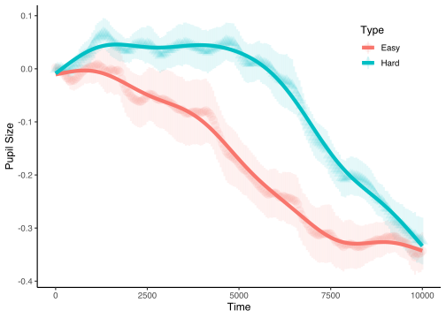

Of course there is the fact that we expect there to by some variation by
trial, and that we should expect there to be differences for each
participant. Our model also only accounts for a small amount of the
variance. This model, therefore is no good. The way to check this is to
assess model fit with the qqnorm, and to check the autocorrelation. We
can do this with the itsadug package:

``` r
library(itsadug)
```

    ## Loading required package: plotfunctions

    ## 
    ## Attaching package: 'plotfunctions'

    ## The following object is masked from 'package:ggplot2':
    ## 
    ##     alpha

    ## Loaded package itsadug 2.3 (see 'help("itsadug")' ).

``` r
qqnorm(resid(m1))
```


``` r
acf_resid(m1)
```

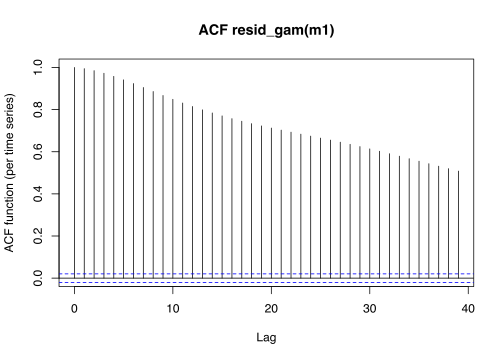

While the qqnorm looks to be almost passable, the autocorrelation in the
second plot is very high. This is an important consideration in
time-series data, and due consideration needs to be given to this. For a
full discussion of how this issue affects time course data, and
specifically pupil data, I highly recommend [Jacolien van Rij et al’s
paper here](https://journals.sagepub.com/doi/10.1177/2331216519832483).

To reduce autocorrelation there are many methods we can try, as you will
see from the above paper. I will stop short of repeating each of the
steps taken in the excellent paper above, and jump straight away to a
much more appropriate model for this data. First I will code in events
(participant per trial). I will also create a second data frame to do
this (model\_data), so that the data we are working with doesn’t lose
its properties, and we can keep using the plotting functions.

``` r
base_data$Event <- interaction(base_data$ID, base_data$Trial, drop = T)

model_data <- base_data
model_data <- start_event(model_data,
                          column = 'Time', event = 'Event')

model_data <- droplevels(model_data[order(model_data$ID,
                                          model_data$Trial,
                                          model_data$Time),])
```

We now need to model this. We are setting an AR parameter, and allowing
events to vary by time. You will see our deviance accounted for is now
up around 96% - much better! The qqnorm is still far from perfect, and
the commented-out model below m2 would do a bit better at this (again
from van Rij et al) by using a scaled t distribution - but would take
ages to run.

``` r
m2 <- bam(mean_pupil ~ Typen +
            s(Time,  by = Typen) +
            s(Time, Event, bs = 'fs', m = 1),
          data = base_data,
          family = gaussian,
          discrete = T,
          AR.start = model_data$start.event, rho = .6)

# m2 <- bam(mean_pupil ~ 
          #   s(Time,  by = Typen) +
          #   s(Time, Event, bs = 'fs', m = 1),
          # data = base_data,
          # family = scat,
          # discrete = T,
          # AR.start = model_data$start.event, rho = .6)

summary(m2)
```

    ## 
    ## Family: gaussian 
    ## Link function: identity 
    ## 
    ## Formula:
    ## mean_pupil ~ Typen + s(Time, by = Typen) + s(Time, Event, bs = "fs", 
    ##     m = 1)
    ## 
    ## Parametric coefficients:
    ##             Estimate Std. Error t value Pr(>|t|)    
    ## (Intercept) -0.16315    0.01448 -11.268   <2e-16 ***
    ## Typen        0.03605    0.08891   0.406    0.685    
    ## ---
    ## Signif. codes:  0 '***' 0.001 '**' 0.01 '*' 0.05 '.' 0.1 ' ' 1
    ## 
    ## Approximate significance of smooth terms:
    ##                   edf  Ref.df       F p-value    
    ## s(Time):Typen   6.361   6.624   2.367  0.0165 *  
    ## s(Time,Event) 418.828 431.000 357.310  <2e-16 ***
    ## ---
    ## Signif. codes:  0 '***' 0.001 '**' 0.01 '*' 0.05 '.' 0.1 ' ' 1
    ## 
    ## Rank: 443/444
    ## R-sq.(adj) =   0.96   Deviance explained = 96.2%
    ## fREML = -21837  Scale est. = 0.0007909  n = 9648

``` r
qqnorm(resid(m2))
```


``` r
acf_resid(m2)
```

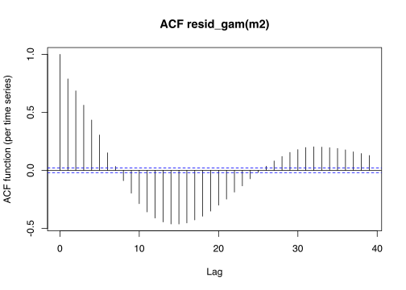

``` r
plot(base_data, pupil = mean_pupil, group = 'condition', model = m2)
```

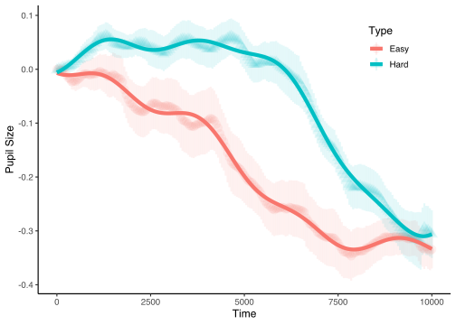

The summary from our second model indicates that there may be marginal
evidence for this effect of condition. But how and when do they
diverge???

(In fact, TJ Mahr was good enough to point out this elegant solution for
this using GAM methods with the itsadug package, which I will [link
to](https://gist.github.com/tjmahr/0d2b41ea1525205a99b19770fc916a90)
rather than take credit for)

Estimating divergences with functional data analysis
----------------------------------------------------

The above analyses may well suffice for what we have planned. However,
sometimes it’s useful for analysis to examine change over time,
especially how and when two conditions diverge, and we can do that with
Functional Data Analysis (FDA). This part of the package makes usage of
the fda package. The complete guide really has been written in 1997 by
Ramsay and Silverman, and there is a very helpful website on FDA
[here](http://www.psych.mcgill.ca/misc/fda/resources.html). This
package is currently only setup to use this analysis for two-condition
experiments, but I hope to add options for functional ANOVA in the
future.

To do this, first we want get the difference between the two conditions
for each participant. By default this package wil take condition 2 -
condition 1, so reorder the factors if required.

``` r
differences <- create_difference_data(data = base_data,
                                      pupil = mean_pupil)
```

    ## Hard minus Easy  -- relevel condition if this is not the intended outcome

``` r
plot(differences, pupil = mean_pupil, geom = 'line')
```


We can now convert this to a functional data structure, made up of
curves. To do this for this data we are going to make it up of cubics
(order = 4) with 10 knots (basis = 10). The appropriate numbers here
will depend on your dataset, and I strongly advise consulting Ramsay and
Silverman’s book, and the FDA website, as well as Sylvain’s paper
mentioned above. This interfaces with the fda package.

``` r
spline_data <- create_functional_data(data = differences,
                                      pupil = mean_pupil,
                                      basis = 10,
                                      order = 4)


plot(spline_data, pupil = mean_pupil, geom = 'line', colour = 'blue')
```

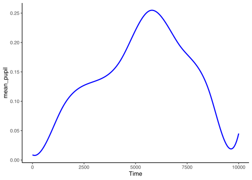

That looks like it’s done a pretty good job capturing the data. The
advantage of this kind of analysis is that we can treat each curve as a
function, and run a single functional t-test to work out during which
window there are divergences. This package allows us to do that
directly, and to observe the results.

``` r
ft_data <- run_functional_t_test(data = spline_data,
                                 pupil = mean_pupil,
                                 alpha = 0.05)
```

    ## critical value for n = 8 is 2.36462425159278

``` r
plot(ft_data, show_divergence = T, colour = 'red', fill = 'orange')
```

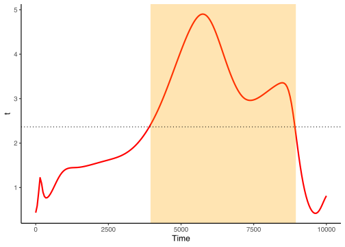

If show\_divergence is set to TRUE, the plot will highlight where the
two conditions diverge at the alpha you set.

*NB* Remember the above discussion on autocorrelation in the GAMMs
portion of this walkthrough? We are still dealing with time-series data,
so this hasn’t necessarily gone away. I am working on adding more
powerful FDA techniques into this package to deal with these issues, so
please watch this space.

Acknowledgements
----------------

This package has had suggestions, encouragement, and help from a number
of people, but I wish to especially highlight Sylvain Sirois and Mihaela
Duta, whose input has been instrumental. I’d also like to thank Jacolien
van Rij for her input with the GAMMs modelling portion of this tutorial.

References
----------

\[1\] Jackson, I., & Sirois, S. (2009). Infant cognition: Going full
factorial with pupil dilation. *Developmental Science*, 12(4), 670-679.
<a href="http://doi.org/10.1111/j.1467-7687.2008.00805.x" class="uri">http://doi.org/10.1111/j.1467-7687.2008.00805.x</a>

\[2\] Allen, M., Poggiali, D., Whitaker, K., Marshall, T. R., & 
Kievit, R. A. (2019). Raincloud plots: a multi-platform tool for 
robust data visualization. *Wellcome Open Research*, 4, 63. 
doi:10.12688/wellcomeopenres.15191.1

\[3\] Ramsay, J.O., & Silverman, B.W. (1997). *Functional data
analysis*. New York: Springer-Verlag.

\[4\] van Rij, J., Hendriks, P., van Rijn, H., Baayen, R. H., & Wood, S.
N. (2019). Analyzing the time course of pupillometric data. Trends in
Hearing, 23, 233121651983248.
<a href="https://doi.org/10.1177/2331216519832483" class="uri">https://doi.org/10.1177/2331216519832483</a>
